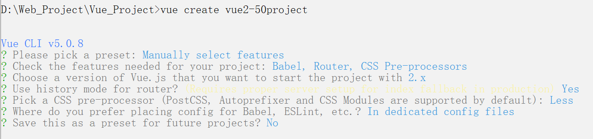
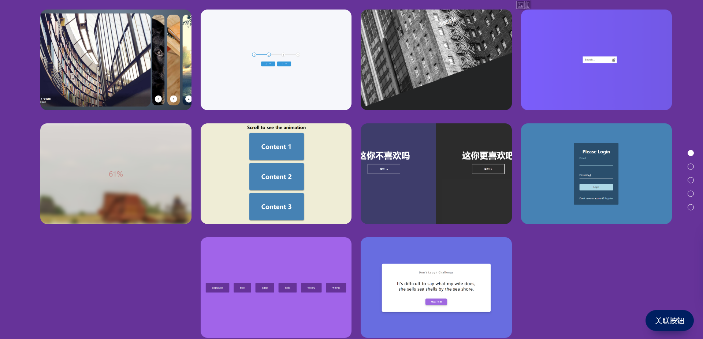

# vue2-50project

## 项目说明

- 本项目用到的技术：Vue2

- 本项目是按照下面的项目进行改造的【50-Case-Studies】

[](https://github.com/zhang-bcxb/50-Case-Studies)

## 项目运行相关

- 运行命令 

```
安装依赖：npm install
运行项目：npm run serve
打包项目：npm run build
```

- 项目相关的 CDN

```
<!-- 样式重置-->
<link href="https://cdn.bootcdn.net/ajax/libs/normalize/8.0.1/normalize.css" rel="stylesheet">
<!-- 导入图标【https://fa5.dashgame.com/#/图标】 -->
<link href="https://cdn.bootcdn.net/ajax/libs/font-awesome/5.14.0/css/all.min.css" rel="stylesheet">

<!-- 对话框【https://sweetalert2.github.io/】 -->
<script src="https://cdn.bootcss.com/limonte-sweetalert2/7.21.1/sweetalert2.all.min.js"></script>
<!--  MD文本转 HTML【https://marked.js.org/】 -->
<script src="https://cdnjs.cloudflare.com/ajax/libs/marked/1.2.2/marked.min.js"></script>
```

- 项目相关的接口

```
随机笑话：
https://icanhazdadjoke.com
口袋妖怪：
https://pokeapi.co/api/v2/pokemon/${id}
https://raw.githubusercontent.com/PokeAPI/sprites/master/sprites/pokemon/
电影界面：
https://api.themoviedb.org/3/discover/movie?sort_by=popularity.desc&api_key=3fd2be6f0c70a2a598f084ddfb75487c&page=1
https://image.tmdb.org/t/p/w1280
https://api.themoviedb.org/3/search/movie?api_key=3fd2be6f0c70a2a598f084ddfb75487c&query={查询参数}
GitHub：
https://api.github.com/users/{用户名称}
https://api.github.com/users/{用户名称}/repos?sort=created
在线搜索用户：
https://randomuser.me/api?results={结果数量}
随机图片：
https://source.unsplash.com/random/310x310

```

## 项目开发说明

- 创建项目截图



## 项目运行说明

- 项目首页截图



- 左侧导航栏


